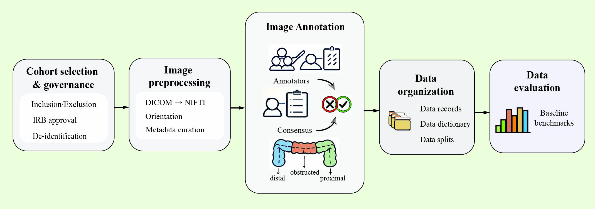
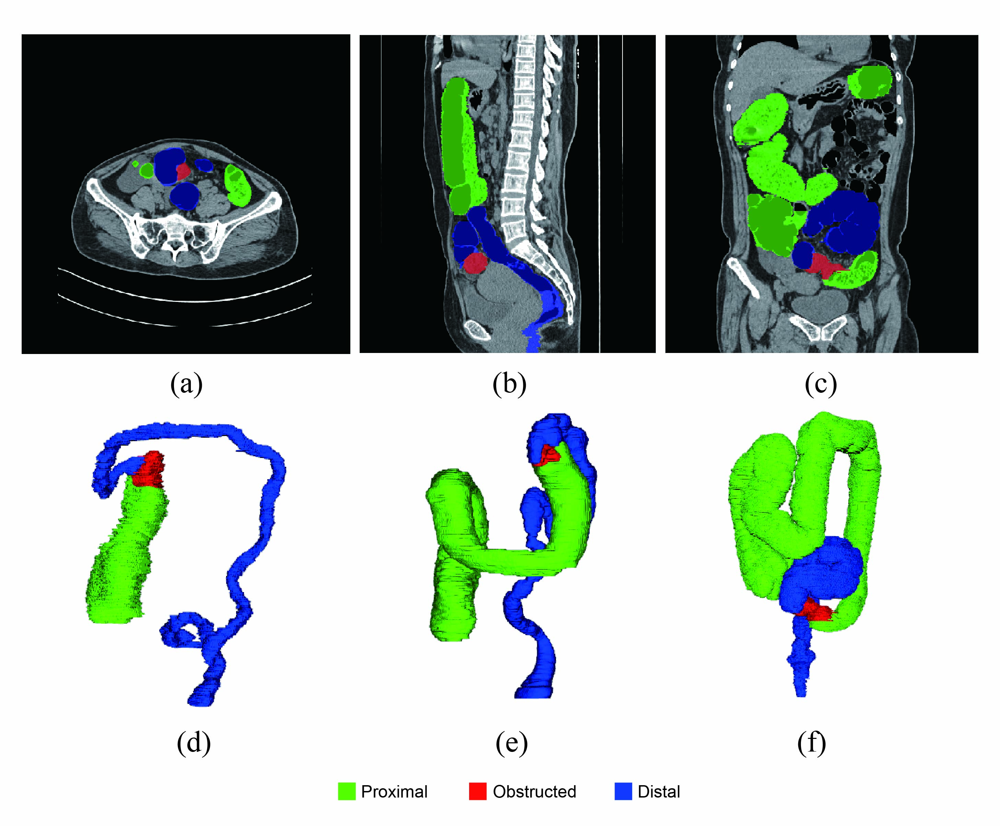

# AMCOD: Acute Malignant Colorectal Obstruction Dataset

[**Paper**](LINK_TO_PAPER) | [**Dataset**](LINK_TO_DATASET) | [**BibTeX**](#citation)

**AMCOD** is the first NECT dataset specifically curated for the segmentation of colorectal obstruction in emergency scenarios.

## 🔐 Data Access (数据访问)
The full AMCOD dataset will be open-sourced upon paper acceptance. 

**For Reviewers / Early Research Access:**
If you require access to the dataset for reproduction or review purposes before the official release, please contact the corresponding author via email: `[fzulab312ai@gmail.com]`. Please include your institution and the purpose of usage in the request.

## 🔥 Why AMCOD?

While current public datasets have advanced the field of medical segmentation, they are primarily optimized for normal anatomy or tumor detection in contrast-enhanced images.

AMCOD aims to extend these capabilities to **emergency settings** by providing data that reflects real-world clinical constraints:
* **Modality:** Non-Enhanced CT (NECT) without bowel preparation.
* **Pathology:** Complex topological changes induced by acute obstruction (e.g., extreme dilation and collapse).

This dataset offers a resource for developing algorithms that are robust to low-contrast images and severe anatomical deformations.


## 🧬 Dataset Construction Workflow

To ensure high-quality benchmarks, AMCOD follows a rigorous data curation pipeline, from cohort selection to final evaluation.




Fig. 1 Overview of the AMCOD dataset construction workflow.

The pipeline consists of four key stages:

1. **Cohort Selection & Governance:** Strict inclusion/exclusion criteria with IRB approval and thorough de-identification.
2. **Preprocessing:** Standardization of orientation and metadata to ensure NIfTI compatibility.
3. **Consensus Annotation:** A "Human-in-the-loop" strategy where radiologists annotate functional segments (proximal, obstructed, distal), followed by expert verification.
4. **Evaluation:** Establishing baselines to benchmark segmentation performance.


## 👁️ Visualization of typical obstruction cases from the AMCOD 

AMCOD provides fine-grained, voxel-level annotations that explicitly capture the pathological topology of colorectal obstruction.




**Legend:**

- 🟢 **Proximal Segment (Green):** Characterized by extreme **dilation** and Fluid-gas retention.
- 🔴 **Obstructed Segment (Red)**:Identified as the **transition zone** (tumor site), usually showing irregular wall thickening.
- 🔵 **Distal Segment (Blue):** Characterized by complete **collapse** and narrow lumen due to the obstruction.

(a)-(c) Representative 2D slices in axial, coronal, and sagittal views, respectively. (d)-(f) 3D surface renderings illustrating pathological variations: (d) typical pathological dilation of the proximal colon; (e) concurrent massive dilation with spatial anomalies; and (f) an extreme case exhibiting highly tortuous morphology and severe deviation from normal anatomy.

## 📜 Citation

Please cite our work if you use this dataset:

```bibtex

```
